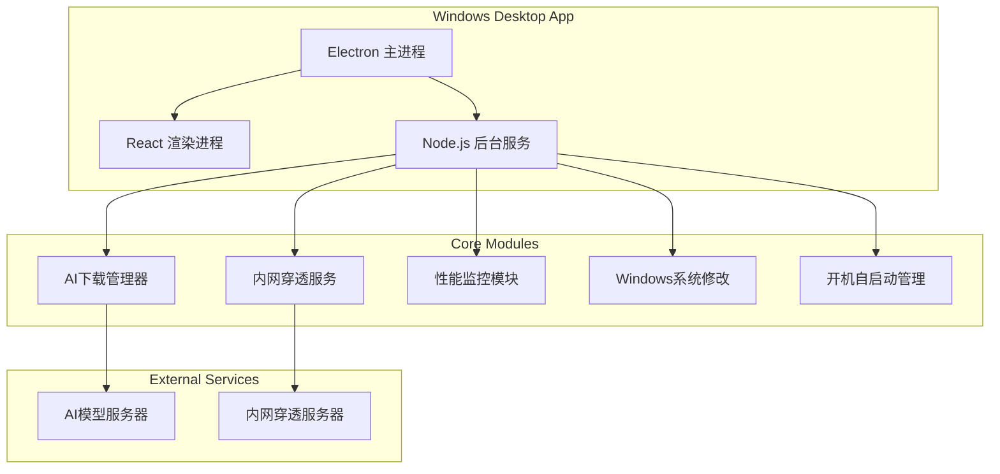

## 1. Architecture Design


## 2. Technology Description
- 前端框架：React@18 + TypeScript
- UI组件库：Tailwind CSS@3
- 桌面框架：Electron@28
- 状态管理：Zustand
- 构建工具：Vite
- 后端：Node.js (集成在Electron主进程中)
- AI部署：Ollama (本地AI运行时)
- 内网穿透：frp

## 3. Route Definitions
| Route | Purpose |
|-------|---------|
| / | 主页面 - AI模型选择和下载管理 |
| /settings | 设置页面 - 系统配置 |
| /status | 状态页面 - 系统监控 |

## 4. Core Modules

### 4.1 AI下载管理器
- 支持多模型并行下载
- 断点续传
- 下载进度实时反馈
- 自动部署到Ollama

### 4.2 内网穿透服务
- 集成frp客户端
- 自动配置端口映射
- 生成公网访问地址
- 连接状态监控

### 4.3 性能监控模块
- 实时采集CPU、内存、GPU使用率
- 性能阈值检测
- 自动调整AI进程优先级和资源限制

### 4.4 Windows系统修改
- 修改开始菜单关机键行为
- 注册表操作
- 电源管理配置

## 5. File Structure
```
/workspace/
├── src/
│   ├── components/       # React组件
│   ├── pages/           # 页面组件
│   ├── store/           # Zustand状态管理
│   ├── utils/           # 工具函数
│   └── App.tsx          # 主应用组件
├── electron/
│   ├── main.ts          # Electron主进程
│   ├── preload.ts       # 预加载脚本
│   └── modules/         # 核心模块
│       ├── ai-manager.ts
│       ├── tunnel.ts
│       ├── performance.ts
│       └── system.ts
├── shared/              # 共享类型定义
└── package.json
```

## 6. Data Model
### 6.1 AI模型配置
```typescript
interface AIModel {
  id: string;
  name: string;
  version: string;
  description: string;
  downloadUrl: string;
  size: string;
  status: 'idle' | 'downloading' | 'installed' | 'error';
  progress: number;
}
```

### 6.2 系统配置
```typescript
interface SystemConfig {
  autoStart: boolean;
  runInBackground: boolean;
  enableTunnel: boolean;
  performanceThreshold: number;
  shutdownToSleep: boolean;
}
```

### 6.3 系统状态
```typescript
interface SystemStatus {
  cpuUsage: number;
  memoryUsage: number;
  gpuUsage: number;
  tunnelUrl: string | null;
  tunnelConnected: boolean;
}
```
