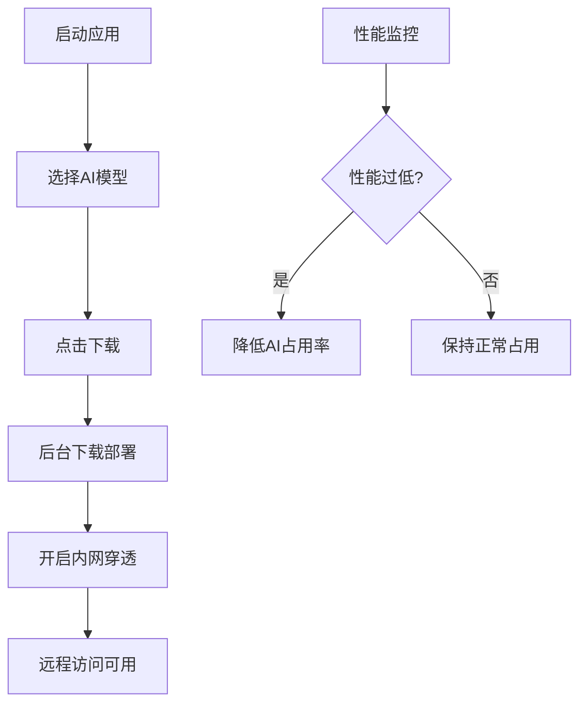

## 1. Product Overview
AI本地部署工具箱是一个Windows桌面应用程序，用于快速下载和本地部署多种主流AI模型，提供内网穿透功能实现远程访问，并包含Windows系统优化功能。

## 2. Core Features

### 2.1 Feature Module
1. **主界面**: AI模型选择、下载进度显示、系统状态监控
2. **设置页面**: 开机自启动、后台运行、性能阈值配置
3. **系统管理**: 关机键修改、进程管理

### 2.3 Page Details
| Page Name | Module Name | Feature description |
|-----------|-------------|---------------------|
| 主界面 | AI模型选择 | 支持GPT5.5、ClaudeOpus4.7、Gemini最新版、DeepSeekR1、豆包最新版的多选或单选下载 |
| 主界面 | 下载管理 | 显示下载进度、暂停/继续下载、下载完成自动部署 |
| 主界面 | 系统状态 | 实时显示CPU、内存、GPU使用率 |
| 设置页面 | 常规设置 | 开机自启动、后台运行、内网穿透开关 |
| 设置页面 | 性能设置 | 性能阈值配置、AI占用率自动调整 |

## 3. Core Process
用户启动应用程序 → 选择需要下载的AI模型 → 点击下载按钮 → 后台下载并部署 → 自动开启内网穿透 → 可通过公网地址远程访问 → 系统监控性能并自动调整资源占用

## 4. User Interface Design
### 4.1 Design Style
- 主色调：深蓝色 (#1e3a8a) 搭配科技感青色 (#06b6d4)
- 按钮风格：圆角矩形，带有微妙的阴影和悬停效果
- 字体：Segoe UI (Windows原生) 搭配 Fira Code (代码显示)
- 布局风格：卡片式布局，侧边导航 + 主内容区域
- 图标风格：简洁的线型图标

### 4.2 Page Design Overview
| Page Name | Module Name | UI Elements |
|-----------|-------------|-------------|
| 主界面 | 模型选择区 | 卡片网格，每个卡片代表一个AI模型，带勾选框和详细信息 |
| 主界面 | 下载进度区 | 进度条、百分比、剩余时间、操作按钮 |
| 主界面 | 系统状态区 | 仪表盘样式的CPU、内存、GPU使用率显示 |
| 设置页面 | 设置项 | 开关控件、滑块、输入框、保存按钮 |

### 4.3 Responsiveness
桌面端优先，支持窗口大小调整，内容自适应布局。

### 4.4 设计原则
- 科技感与实用性并重
- 操作流程直观清晰
- 状态反馈及时明确
